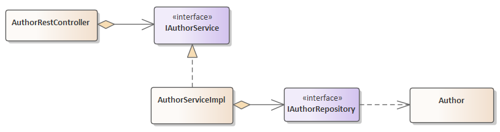
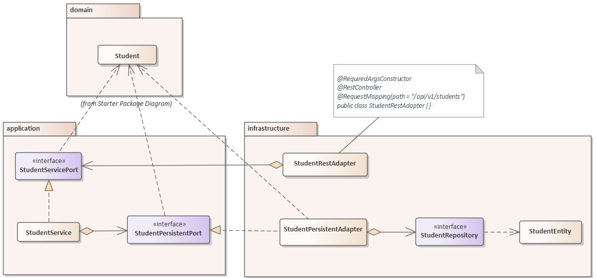
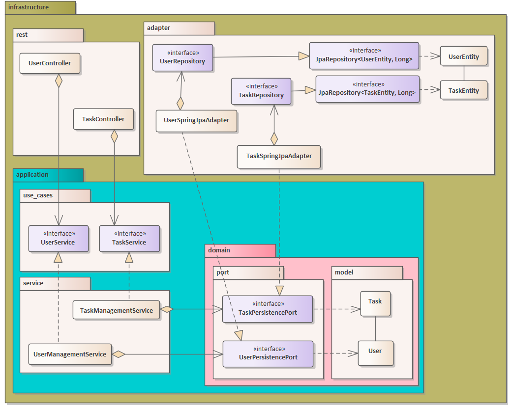
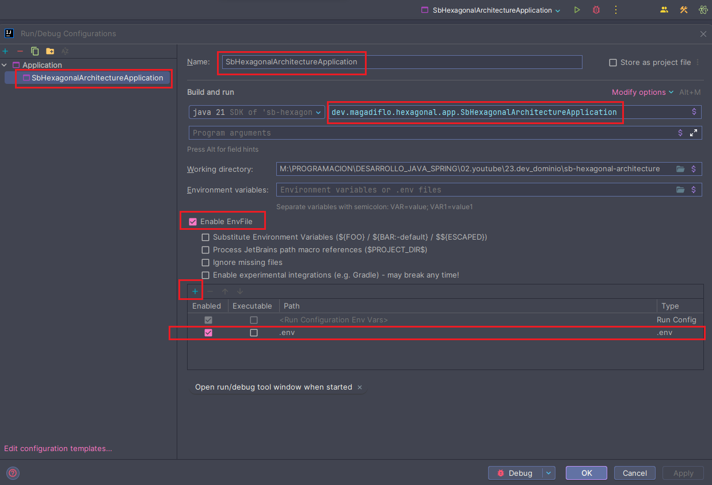

# [Creación de un API REST usando arquitectura hexagonal con Springboot 3 - 2024](https://www.youtube.com/watch?v=xn3E3EKK5jM&t=54s)

Tutorial tomado del canal de youtube de **Dev Dominio**

---

# Arquitectura en Capas vs Arquitectura Hexagonal

A continuación mostraré las clases e interfaces más importante sobre las que se sustenta las distintas arquitectura.
Esto lo hago con la finalidad de tener una visión de cómo es que las clases e interfaces interactúan entre sí
dependiendo de la arquitectura.

## Arquitectura de capas

En este ejemplo, he querido representar cómo es que se crearía un CRUD de la entidad llamada Author. Aquí observamos
los típicos paquetes que se crean en una aplicación de Spring Boot: `Entity`, `Repository`, `Service` y `Controller`.
Obviamente, hay muchas otras clases, como los dtos, mensajes de errores, excepciones, utilidades, etc. por eso es
que menciono que estamos representando las clases e interfaces principales.



## Arquitectura hexagonal de este proyecto

En esta arquitectura mostramos los paquetes: `domain`, `application` y `infrastructure`. Vemos que la estructura
**es muy distinta a la arquitectura en capas**.

`La arquitectura hexagonal`, también conocida como arquitectura de puertos y adaptadores, es un patrón de diseño de
software que tiene como objetivo principal separar las responsabilidades de cada componente de un sistema. Esta
arquitectura se basa en la idea de que las aplicaciones deben ser independientes de la tecnología subyacente y, por lo
tanto, fácilmente intercambiables.

Nuevamente, hago hincapié en que en el diagrama solo muestro las clases e interfaces más representativas.



## [Ejemplo de una Arquitectura Hexagonal](https://www.youtube.com/watch?v=eZxi99c9UWM)

Revisando videos me topé con este ejemplo de `Arquitectura Hexagonal`. A continuación muestro el diagrama realizado
en base a la arquitectura hexagonal mostrada en este otro proyecto. Lo muestro aquí para tener una referencia de ver
que existe esta otra manera de implementar, aunque **básicamente es lo mismo que implementaremos en nuestro proyecto
`sb-hexagonal-architecture`**.

**Si damos click en la imagen nos llevará al repositorio**

[](https://github.com/JamiltonQuintero/NotModularHexagonalArquitecture)

---

## Dependencias

Notar que estamos especificando la versión de `Lombook` y la de `MapStruct`, dado que al tener ambas librerías en el
mismo proyecto de `Spring Boot` pueden generar conflicto y no trabajar como se espera, es por eso que es necesario
especificar las versiones.

````xml
<!--Spring Boot 3.2.4-->
<!--Java 21-->
<dependencies>
    <dependency>
        <groupId>org.springframework.boot</groupId>
        <artifactId>spring-boot-starter-data-jpa</artifactId>
    </dependency>
    <dependency>
        <groupId>org.springframework.boot</groupId>
        <artifactId>spring-boot-starter-validation</artifactId>
    </dependency>
    <dependency>
        <groupId>org.springframework.boot</groupId>
        <artifactId>spring-boot-starter-web</artifactId>
    </dependency>

    <dependency>
        <groupId>org.postgresql</groupId>
        <artifactId>postgresql</artifactId>
        <scope>runtime</scope>
    </dependency>
    <dependency>
        <groupId>org.projectlombok</groupId>
        <artifactId>lombok</artifactId>
        <version>1.18.30</version>
        <scope>provided</scope>
    </dependency>
    <dependency>
        <groupId>org.mapstruct</groupId>
        <artifactId>mapstruct</artifactId>
        <version>1.5.5.Final</version>
    </dependency>
    <dependency>
        <groupId>org.springframework.boot</groupId>
        <artifactId>spring-boot-starter-test</artifactId>
        <scope>test</scope>
    </dependency>
</dependencies>
````

## Plugins

Los plugins dentro del `pom.xml` también los modificaremos, a causa de que estamos trabajando con `Lombook`
y `MapStruct`. Al realizar esta configuración, estaremos permitiendo que tanto `Lombook` y `MapStruct` puedan trabajar
juntos:

````xml

<build>
    <plugins>
        <!--        Plugin por defecto-->
        <!--        <plugin>-->
        <!--            <groupId>org.springframework.boot</groupId>-->
        <!--            <artifactId>spring-boot-maven-plugin</artifactId>-->
        <!--            <configuration>-->
        <!--                <excludes>-->
        <!--                    <exclude>-->
        <!--                        <groupId>org.projectlombok</groupId>-->
        <!--                        <artifactId>lombok</artifactId>-->
        <!--                    </exclude>-->
        <!--                </excludes>-->
        <!--            </configuration>-->
        <!--        </plugin>-->
        <plugin>
            <groupId>org.apache.maven.plugins</groupId>
            <artifactId>maven-compiler-plugin</artifactId>
            <version>3.11.0</version>
            <configuration>
                <source>21</source>
                <target>21</target>
                <annotationProcessorPaths>
                    <path>
                        <groupId>org.projectlombok</groupId>
                        <artifactId>lombok</artifactId>
                        <version>1.18.30</version>
                    </path>
                    <path>
                        <groupId>org.mapstruct</groupId>
                        <artifactId>mapstruct-processor</artifactId>
                        <version>1.5.5.Final</version>
                    </path>
                    <path>
                        <groupId>org.projectlombok</groupId>
                        <artifactId>lombok-mapstruct-binding</artifactId>
                        <version>0.2.0</version>
                    </path>
                </annotationProcessorPaths>
            </configuration>
        </plugin>
    </plugins>
</build>
````

---

# DOMAIN

---

## Modelo de dominio

**El proyecto consiste en la creación de un CRUD para estudiantes,** así que, como primera implementación utilizando
`arquitectura hexagonal` será crear el modelo de dominio con el que vamos a representar a un `Student`.

Utilizando el siguiente directorio, crearemos nuestra clase de dominio `Student.java`:

> `/domain/model/Student.java`

La clase `Student` será nuestra clase de dominio. Las clases de dominio o modelos de dominio simplemente son `POJOS`.
Veamos con más detalle lo que son las **clases de dominio (POJO - Plain Old Java Object):**

- Una clase de dominio, también conocida como `POJO`, es una clase simple que típicamente encapsula datos y **no tiene
  ninguna lógica relacionada con la persistencia o la manipulación de datos.**


- Estas clases se utilizan para modelar objetos del mundo real en tu aplicación.


- Suelen ser clases simples con atributos, métodos de acceso (getters y setters) y, a veces, métodos de utilidad.


- No tienen ninguna anotación específica de persistencia, ya que no están directamente relacionadas con el
  almacenamiento de datos en una base de datos. Por lo tanto, son independientes de la capa de persistencia.

Por consiguiente, las clases de dominio son objetos con el que representamos el dominio, de tal forma que si más
adelante dejamos de usar PostgresSQL o MySQL y usamos una base de datos no relacional como MongoDB o Casandra,
este objeto de dominio va a permanecer invariable, es decir, no va a cambiar con ese tipo de particularidades.

### Modelo Student

````java

@Builder
@Getter
@Setter
@NoArgsConstructor
@AllArgsConstructor
public class Student {
    private Long id;
    private String firstName;
    private String lastName;
    private Integer age;
    private String address;
}
````

Adicionalmente, crearemos un paquete de excepciones para nuestro **modelo de dominio**. En esta oportunidad crearemos la
excepción `StudentNotFoundException`:

### Excepción para el modelo Student

````java
public class StudentNotFoundException extends RuntimeException {
    public StudentNotFoundException(String message) {
        super(message);
    }
}
````

---

# APPLICATION

---

En la capa de aplicación crearemos los puertos de entrada `(input)` y de salida `(output)`, además **crearemos la
implementación del puerto de entrada (service) que a su vez hará uso del puerto de salida (como inyección de
dependencia).**

## Puerto de entrada (input)

Esta interfaz contendrá operaciones que se pueden hacer con el modelo de dominio Student. Aquí detallamos la
funcionalidad de la aplicación.

Para nuestro proyecto, aquí definimos los métodos `CRUD`:

````java
public interface StudentServicePort {
    List<Student> findAllStudents();

    Student findStudentById(Long id);

    Student saveStudent(Student student);

    Student updateStudent(Long id, Student student);

    void deleteStudentById(Long id);
}
````

## Puerto de salida (output)

Aquí definimos los métodos necesarios que permitirán **interactuar** con la parte externa, **con la parte de
persistencia.** Puede haber distintos puertos de salida, por ejemplo, si se quiere mandar hacia una cola de mensajes.

Los métodos siguientes se utilizarán para almacenar los objetos de dominio, es por eso que aquí no declaramos el método
update, ya que será realizado por el método save.

````java
public interface StudentPersistentPort {
    List<Student> findAllStudents();

    Optional<Student> findStudentById(Long id);

    Student saveStudent(Student student);

    void deleteStudentById(Long id);
}
````

## Implementación del puerto de entrada (Servicio)

El servicio de la capa de aplicación implementa el puerto de entrada y hace uso del puerto de salida. En otras palabras,
aquí estamos definiendo la implementación del puerto de entrada (StudentServicePor) y además, estamos inyectando una
futura implementación del puerto de salida (StudentPersistentPort) y digo **"futura implementación"** puesto que lo que
realmente estamos usando es el puerto de salida (interfaz StudentPersistentPort) que en tiempo de ejecución tomará
una implementación concreta.

````java

@RequiredArgsConstructor
@Service
public class StudentService implements StudentServicePort {

    private final StudentPersistentPort studentPersistentPort;

    @Override
    public List<Student> findAllStudents() {
        return this.studentPersistentPort.findAllStudents();
    }

    @Override
    public Student findStudentById(Long id) {
        return this.studentPersistentPort.findStudentById(id)
                .orElseThrow(() -> new StudentNotFoundException("Error al buscar estudiante. No se encuentra con id: %s".formatted(id)));
    }

    @Override
    public Student saveStudent(Student student) {
        return this.studentPersistentPort.saveStudent(student);
    }

    @Override
    public Student updateStudent(Long id, Student student) {
        return this.studentPersistentPort.findStudentById(id)
                .map(studentDB -> {
                    studentDB.setFirstName(student.getFirstName());
                    studentDB.setLastName(student.getLastName());
                    studentDB.setAge(student.getAge());
                    studentDB.setAddress(student.getAddress());
                    return studentDB;
                })
                .map(this.studentPersistentPort::saveStudent)
                .orElseThrow(() -> new StudentNotFoundException("Error al actualizar estudiante. No se encuentra con id: %s".formatted(id)));
    }

    @Override
    public void deleteStudentById(Long id) {
        if (this.studentPersistentPort.findStudentById(id).isEmpty()) {
            throw new StudentNotFoundException("Error al eliminar estudiante. No se encuentra con id: %s".formatted(id));
        }
        this.studentPersistentPort.deleteStudentById(id);
    }
}
````

---

# INFRASTRUCTURE

---

En esta capa vamos a definir los elementos de salida y entrada a nuestra aplicación. Empezaremos creando las entidades,
mismos que serán usados para poder almacenar los datos en la base de datos.

## Entidades

````java

@Builder
@Getter
@Setter
@NoArgsConstructor
@AllArgsConstructor
@Entity
@Table(name = "students")
public class StudentEntity {
    @Id
    @GeneratedValue(strategy = GenerationType.IDENTITY)
    private Long id;
    private String firstName;
    private String lastName;
    private Integer age;
    private String address;
}
````

## Repositorio

Crearemos la interfaz de repositorio que al extender de la interfaz de Spring Boot Data JPA, nos permitirá interactuar
con la entidad `StudentEntity` y la base de datos:

````java
public interface StudentRepository extends JpaRepository<StudentEntity, Long> {
}
````

## Mapeando: dominio - entidad

Recordemos que en el `pom.xml` hemos agregado la dependencia del `mapstruct`, esta dependencia nos permitirá establecer
el mapeo entre el dominio y las clases de entidad. Así que ahora necesitamos crear una interfaz al que le
agregaremos la anotación `@Mapper(componentModel = "spring")`, esta anotación nos permite decirle a spring que inyecte
esta interfaz como un componente de spring.

````java

@Mapper(componentModel = "spring") // Permite que esta interfaz se inyecte como un componente de Spring
public interface StudentPersistentMapper {

    // Convertirá un Student en un StudentEntity. Como ambas clases tienen los mismos atributos, no es necesario
    // agregar anotaciones adicionales. Si tuvieran campos distintos podríamos usar por ejemplo:
    // @Mapping(target = "age", source = "edad")
    StudentEntity toStudentEntity(Student student);

    Student toStudent(StudentEntity entity);

    List<Student> toStudentList(List<StudentEntity> studentEntityList);
}
````

## Implementación del puerto de salida (output) de la capa de aplicación

En la capa de aplicación definimos una interfaz como puerto de salida (output) llamada `StudentPersistentPort`. Esta
interfaz está siendo inyectada la clase `StudentService` de la misma capa de aplicación, eso significa que, esa clase
está esperando una implementación concreta de la interfaz `StudentPersistentPort`, es por eso que ahora en esta capa de
aplicación realizamos la implementación concreta de dicha interfaz:

````java

@RequiredArgsConstructor
@Service
public class StudentPersistentAdapter implements StudentPersistentPort {

    private final StudentRepository studentRepository;
    private final StudentPersistentMapper studentPersistentMapper;

    @Override
    @Transactional(readOnly = true)
    public List<Student> findAllStudents() {
        List<StudentEntity> studentEntityList = this.studentRepository.findAll();
        return this.studentPersistentMapper.toStudentList(studentEntityList);
    }

    @Override
    @Transactional(readOnly = true)
    public Optional<Student> findStudentById(Long id) {
        return this.studentRepository.findById(id)
                .map(this.studentPersistentMapper::toStudent);
    }

    @Override
    @Transactional
    public Student saveStudent(Student student) {
        StudentEntity studentEntity = this.studentPersistentMapper.toStudentEntity(student);
        StudentEntity studentSaved = this.studentRepository.save(studentEntity);
        return this.studentPersistentMapper.toStudent(studentSaved);
    }

    @Override
    @Transactional
    public void deleteStudentById(Long id) {
        this.studentRepository.deleteById(id);
    }
}
````

## Modelo de request

Crearemos un `DTO` que nos permitirá mapear la información enviada desde el cliente hacia en el endpoint rest. Este
dto se usará tanto en el endpoint para guardar y actualizar.

Notar que en este `DTO` estamos estableciendo las anotaciones de validación. Estas anotaciones se activarán cuando
en el parámetro del método que use el dto usemos la anotación `@Valid`.

````java

@Builder
@Getter
@Setter
@NoArgsConstructor
@AllArgsConstructor
public class StudentCreateRequest {
    @NotBlank(message = "El campo firstName no puede estar vacío o ser nulo")
    private String firstName;

    @NotBlank(message = "El campo lastName no puede estar vacío o ser nulo")
    private String lastName;

    @NotNull(message = "El campo age no puede ser nulo")
    private Integer age;

    @NotBlank(message = "El campo address no puede estar vacío o ser nulo")
    private String address;
}
````

## Modelo de response

Este `DTO` se usará para enviar información desde el backend hacia el cliente http.

````java

@Builder
@Getter
@Setter
@NoArgsConstructor
@AllArgsConstructor
public class StudentResponse {
    private Long id;
    private String firstName;
    private String lastName;
    private Integer age;
    private String address;
}
````

## Mapeando: dominio - dto

`unmappedTargetPolicy = ReportingPolicy.IGNORE`: Esta configuración indica a `MapStruct` que ignore las propiedades
de destino que no están mapeadas explícitamente en el mapper. Esto evita que se generen advertencias en tiempo de
compilación por propiedades no mapeadas.

Tomemos como ejemplo el siguiente método:

````java
Student toStudent(StudentCreateRequest request);
````

Si en el campo de destino `(Student)` existe un atributo que no hay en clase de origen `(StudentCreateRequest)`, con la
configuración `unmappedTargetPolicy = ReportingPolicy.IGNORE`, ignoramos que se haga el mapeo de ese campo de destino.

En nuestro ejemplo, el modelo de dominio `Student` tiene un atributo llamado `id` que no tiene la clase de origen
`StudentCreateRequest`, por lo tanto, con la configuración anterior, **el mapeo de ese campo se va a ignorar.**

````java

@Mapper(componentModel = "spring", unmappedTargetPolicy = ReportingPolicy.IGNORE)
public interface StudentRestMapper {
    Student toStudent(StudentCreateRequest request);

    StudentResponse toStudentResponse(Student student);

    List<StudentResponse> toStudentResponseList(List<Student> students);
}
````

## Adapter Input Rest: StudentRestAdapter

En esta clase definimos los endpoints de nuestros estudiantes. Observar que en los endpoints estamos regresando siempre
el dto `StudentResponse` que hemos creado, pero podríamos usar el propio dominio `Student`, eso va a depender de cómo
queremos manejarlo y qué información queremos exponer. Sin embargo, por ningún motivo debemos enviar como respuesta las
entidades de la aplicación `StudentEntity`, ni mucho menos usarlos como parámetros de los métodos de los endpoints.

````java

@RequiredArgsConstructor
@RestController
@RequestMapping(path = "/api/v1/students")
public class StudentRestAdapter {

    private final StudentServicePort studentServicePort;
    private final StudentRestMapper studentRestMapper;

    @GetMapping
    public ResponseEntity<List<StudentResponse>> findAllStudents() {
        List<StudentResponse> studentResponses = this.studentRestMapper.toStudentResponseList(this.studentServicePort.findAllStudents());
        return ResponseEntity.ok(studentResponses);
    }

    @GetMapping(path = "/{studentId}")
    public ResponseEntity<StudentResponse> findStudent(@PathVariable Long studentId) {
        Student student = this.studentServicePort.findStudentById(studentId);
        return ResponseEntity.ok(this.studentRestMapper.toStudentResponse(student));
    }

    @PostMapping
    public ResponseEntity<StudentResponse> saveStudent(@Valid @RequestBody StudentCreateRequest studentCreateRequest) {
        Student student = this.studentRestMapper.toStudent(studentCreateRequest);
        Student studentDB = this.studentServicePort.saveStudent(student);
        URI uri = URI.create("/api/v1/students/" + studentDB.getId());
        return ResponseEntity.created(uri).body(this.studentRestMapper.toStudentResponse(studentDB));
    }

    /**
     * Para este caso particular el dto StudentCreateRequest, será el mismo que usamos en el endpoint saveStudent().
     * Sin embargo, podríamos crear un dto exclusivo para este updateStudent(), 
     * todo va a depender de qué campos consideramos deben ser actualizables.
     */
    @PutMapping(path = "/{studentId}")
    public ResponseEntity<StudentResponse> updateStudent(@Valid @RequestBody StudentCreateRequest studentCreateRequest, @PathVariable Long studentId) {
        Student student = this.studentRestMapper.toStudent(studentCreateRequest);
        Student studentDB = this.studentServicePort.updateStudent(studentId, student);
        return ResponseEntity.ok(this.studentRestMapper.toStudentResponse(studentDB));
    }

    @DeleteMapping(path = "/{studentId}")
    public ResponseEntity<Void> deleteStudent(@PathVariable Long studentId) {
        this.studentServicePort.deleteStudentById(studentId);
        return ResponseEntity.noContent().build();
    }
}
````

---

# Manejo de excepciones

---

## Catálogo de errores

Para el manejo de excepciones crearemos en primer lugar nuestro catálogo de errores. En este catálogo se irán definiendo
una serie de códigos de errores personalizados que asignaremos a ciertos errores que puedan ocurrir:

````java

@Getter
public enum ErrorCatalog {

    STUDENT_NOT_FOUND("ERR_STUDENT_001", "Estudiante no encontrado."),
    INVALID_STUDENT("ERR_STUDENT_002", "Parámetros inválidos del estudiante."),
    GENERIC_ERROR("ERR_GEN_001", "Ocurrió un error inesperado");

    private final String code;
    private final String message;

    ErrorCatalog(String code, String message) {
        this.code = code;
        this.message = message;
    }
}
````

## Modelo de respuesta

Crearemos nuestro modelo de respuesta, es decir, cada vez que ocurra un error, nuestro backend enviará al cliente
siempre el mismo formato de respuesta para que haya uniformidad:

````java

@Builder
@Getter
@Setter
public class ErrorResponse {
    private String code;
    private String message;
    private List<String> details;
    private LocalDateTime timestamp;
}
````

## Rest Controller Advice

La clase de controlador de errores globales las colocaremos junto a nuestro controlador `StudentRestAdapter`, ya que
en teoría también es un controlador pero de errores:

````java

@RestControllerAdvice
public class GlobalControllerAdvice {

    @ExceptionHandler(StudentNotFoundException.class)
    public ResponseEntity<ErrorResponse> handleStudentNotFoundException() {
        ErrorResponse errorResponse = ErrorResponse.builder()
                .code(ErrorCatalog.STUDENT_NOT_FOUND.getCode())
                .message(ErrorCatalog.STUDENT_NOT_FOUND.getMessage())
                .timestamp(LocalDateTime.now())
                .build();
        return ResponseEntity.status(HttpStatus.NOT_FOUND).body(errorResponse);
    }

    @ExceptionHandler(MethodArgumentNotValidException.class)
    public ResponseEntity<ErrorResponse> handleMethodArgumentNotValidException(MethodArgumentNotValidException exception) {
        BindingResult bindingResult = exception.getBindingResult();
        List<String> fieldErrorsList = bindingResult.getFieldErrors().stream()
                .map(FieldError::getDefaultMessage).toList();

        ErrorResponse errorResponse = ErrorResponse.builder()
                .code(ErrorCatalog.INVALID_STUDENT.getCode())
                .message(ErrorCatalog.INVALID_STUDENT.getMessage())
                .details(fieldErrorsList)
                .timestamp(LocalDateTime.now())
                .build();
        return ResponseEntity.status(HttpStatus.BAD_REQUEST).body(errorResponse);
    }

    @ExceptionHandler(Exception.class)
    public ResponseEntity<ErrorResponse> handleGenericException(Exception exception) {
        ErrorResponse errorResponse = ErrorResponse.builder()
                .code(ErrorCatalog.GENERIC_ERROR.getCode())
                .message(ErrorCatalog.GENERIC_ERROR.getMessage())
                .details(Collections.singletonList(exception.getMessage()))
                .timestamp(LocalDateTime.now())
                .build();
        return ResponseEntity.status(HttpStatus.INTERNAL_SERVER_ERROR).body(errorResponse);
    }
}
````

## Creando data.sql

Para poblar nuestra tabla `students` crearemos el archivo `data.sql` en el directorio `/resources`, pero hay que tener
en cuenta que para que este archivo se ejecute correctamente se debe agregar las siguientes dos
configuraciones: `spring.jpa.defer-datasource-initialization=true` y `spring.sql.init.mode=always`.

Es importante tener en cuenta además, que usaremos la configuración `ddl-auto=create`, para que cada vez que la
aplicación se levante se eliminen las tablas existentes y se vuelva a crear y además se pueblen nuevamente con los
datos del `data.sql`:

````sql
INSERT INTO students(first_name, last_name, age, address)
VALUES('Martín', 'Díaz', 35, 'Chimbote'),
('Melissa', 'Peralta', 25, 'Lima'),
('Arely', 'Culqui', 20, 'Ayacucho'),
('Karen', 'Caldas', 32, 'Trujillo'),
('Carmen', 'Vega', 31, 'Cajamarca');
````

## Configura application.yml

````yml
server:
  port: 8080
  error:
    include-message: always

spring:
  application:
    name: sb-hexagonal-architecture

  datasource:
    url: ${DATABASE_URL}
    username: ${DATABASE_USERNAME}
    password: ${DATABASE_PASSWORD}

  sql:
    init:
      mode: always

  jpa:
    defer-datasource-initialization: true
    hibernate:
      ddl-auto: create
    properties:
      hibernate:
        format_sql: true

  jackson:
    default-property-inclusion: non_null
    property-naming-strategy: SNAKE_CASE

logging:
  level:
    org.hibernate.SQL: DEBUG
````

- La configuración `spring.jackson.default-property-inclusion=non_null` se refiere a la forma en que Jackson (la
  biblioteca utilizada para la serialización y deserialización de objetos JSON en Spring) maneja la inclusión de
  propiedades en la serialización de objetos Java a JSON.
  <br><br>
  Cuando se establece esta propiedad en `non_null`, significa que **Jackson solo incluirá en la representación JSON
  aquellas propiedades de un objeto Java que no sean nulas.** Es decir, las propiedades que tengan un valor distinto de
  nulo se incluirán en el JSON resultante, mientras que **aquellas con valor nulo no se mostrarán en la salida JSON.**
  <br><br>
  La configuración `spring.jackson.default-property-inclusion=non_null` es equivalente a utilizar la
  anotación `@JsonInclude(JsonInclude.Include.NON_NULL)` a nivel de clase en las clases de tu aplicación de Spring Boot.
  <br><br>
  **En este proyecto se opta por usar la configuración en el `application.yml` para evitar estar colocando la anotación
  en cada clase que vaya a ser transformado a `JSON`.**
  <br><br>
- `spring.jackson.property-naming-strategy=SNAKE_CASE`, especifica la **estrategia de nomenclatura que se utilizará al
  serializar y deserializar objetos Java a JSON** utilizando Jackson.
  <br><br>
  Cuando se configura como `SNAKE_CASE`, Jackson convertirá automáticamente los nombres de las propiedades de los
  objetos Java a notación `snake_case` antes de serializarlos a JSON. Esto significa que **las propiedades se
  convertirán de `camelCase` (por ejemplo, `miPropiedad`) a `snake_case` (por ejemplo, `mi_propiedad`) en el JSON
  resultante.**
  <br><br>
  Con la configuración `SNAKE_CASE`, si nuestra aplicación recibe un objeto `JSON`, `Jackson` esperará que las
  propiedades del objeto `JSON` estén en formato `snake_case`. `Jackson` las convertirá a camelCase para que coincidan
  con las propiedades de tu objeto Java durante el proceso de de-serialización.
  <br><br>
- `spring.jpa.defer-datasource-initialization=true`, de forma predeterminada, los scripts `data.sql` se ejecutan antes
  de que se inicialice Hibernate. **Necesitamos Hibernate para crear nuestras tablas antes de insertar los datos en
  ellas. Para lograr esto, necesitamos diferir la inicialización de nuestra fuente de datos.** En ese sentido, usaremos
  la siguiente propiedad para lograr eso.
  <br><br>
- `spring.sql.init.mode=always`, tenga en cuenta que para cualquier inicialización basada en script, es decir, insertar
  datos mediante `data.sql` o crear un esquema mediante `schema.sql`, debemos establecer esta propiedad. Sin embargo,
  para bases de datos embebidas como `H2`, esta configuración no es necesaria, dado que está configurado en `always`
  por defecto.

## Variables de entorno

Vamos a crear el archivo `.env` en la raíz del proyecto donde agregaremos nuestras variables de entorno. Si vemos el
archivo `application.yml` observaremos que estamos haciendo uso de tres variables de entorno para la configuración de
la base de datos: `${DATABASE_URL}`, `${DATABASE_USERNAME}`, `${DATABASE_PASSWORD}`.

Ahora, en el archivo `.env` definimos las variables de entorno con sus valores:

````properties
DATABASE_URL=jdbc:postgresql://localhost:5432/db_hexagonal_architecture
DATABASE_USERNAME=postgres
DATABASE_PASSWORD=magadiflo
````

## Configurando variables de entorno

Para usar las variables de entorno del archivo `.env` en nuestro proyecto de Spring Boot, utilizaremos nuestro IDE
`IDE IntelliJ IDEA` para poder seleccionar y usar el archivo `.env`:



## Ejecutando aplicación (lado positivo)

### Listar estudiantes

````bash
$ curl -v http://localhost:8080/api/v1/students | jq

>
< HTTP/1.1 200
< Content-Type: application/json
<
[
  {
    "id": 1,
    "first_name": "Martín",
    "last_name": "Díaz",
    "age": 35,
    "address": "Chimbote"
  },
  {
    "id": 2,
    "first_name": "Melissa",
    "last_name": "Peralta",
    "age": 25,
    "address": "Lima"
  },
  {
    "id": 3,
    "first_name": "Arely",
    "last_name": "Culqui",
    "age": 20,
    "address": "Ayacucho"
  },
  {
    "id": 4,
    "first_name": "Karen",
    "last_name": "Caldas",
    "age": 32,
    "address": "Trujillo"
  },
  {
    "id": 5,
    "first_name": "Carmen",
    "last_name": "Vega",
    "age": 31,
    "address": "Cajamarca"
  }
]
````

### Buscar estudiante por su id

````bash
$ curl -v http://localhost:8080/api/v1/students/2 | jq

>
< HTTP/1.1 200
<
{
  "id": 2,
  "first_name": "Melissa",
  "last_name": "Peralta",
  "age": 25,
  "address": "Lima"
}
````

### Guardar estudiante

````bash
$ curl -v -X POST -H "Content-Type: application/json" -d "{\"first_name\": \"Alicia\", \"last_name\": \"Mendez\", \"age\": 40, \"address\": \"Cusco\"}" http://localhost:8080/api/v1/students | jq

< HTTP/1.1 201
< Location: /api/v1/students/6
<
{
  "id": 6,
  "first_name": "Alicia",
  "last_name": "Mendez",
  "age": 40,
  "address": "Cusco"
}
````

### Actualizar estudiante

````bash
$ curl -v -X PUT -H "Content-Type: application/json" -d "{\"first_name\": \"Sandra\", \"last_name\": \"Pardo\", \"age\": 25, \"address\": \"Cusco\"}" http://localhost:8080/api/v1/students/6 | jq

< HTTP/1.1 200
<
{
  "id": 6,
  "first_name": "Sandra",
  "last_name": "Pardo",
  "age": 25,
  "address": "Cusco"
}
````

### Eliminar estudiante

````bash
$ curl -v -X DELETE http://localhost:8080/api/v1/students/6 | jq

>
< HTTP/1.1 204
````

## Ejecutando aplicación (mostrando errores)

### Buscar estudiante por un id no existente

````bash
$ curl -v http://localhost:8080/api/v1/students/20 | jq

>
< HTTP/1.1 404
<
{
  "code": "ERR_STUDENT_001",
  "message": "Estudiante no encontrado.",
  "timestamp": "2024-04-02T12:58:29.9104659"
}
````

### Guardar estudiante con campos inválidos

````bash
$ curl -v -X POST -H "Content-Type: application/json" -d "{\"last_name\": \"Mendez\", \"age\": 40, \"address\": \"\"}" http://localhost:8080/api/v1/students | jq

< HTTP/1.1 400
<
{
  "code": "ERR_STUDENT_002",
  "message": "Parámetros inválidos del estudiante.",
  "details": [
    "El campo firstName no puede estar vacío o ser nulo",
    "El campo address no puede estar vacío o ser nulo"
  ],
  "timestamp": "2024-04-02T12:57:42.2344671"
}
````

### Actualizar estudiante con id no existente

````bash
$ curl -v -X PUT -H "Content-Type: application/json" -d "{\"first_name\": \"Sandra\", \"last_name\": \"Pardo\", \"age\": 25, \"address\": \"Cusco\"}" http://localhost:8080/api/v1/students/6 | jq

< HTTP/1.1 404
<
{
  "code": "ERR_STUDENT_001",
  "message": "Estudiante no encontrado.",
  "timestamp": "2024-04-02T12:55:54.4984721"
}
````

### Actualizar estudiante con campos inválidos

````bash
$ curl -v -X PUT -H "Content-Type: application/json" -d "{\"first_name\": \"Sandra\"}" http://localhost:8080/api/v1/students/1 | jq

< HTTP/1.1 400
<
{
  "code": "ERR_STUDENT_002",
  "message": "Parámetros inválidos del estudiante.",
  "details": [
    "El campo age no puede ser nulo",
    "El campo lastName no puede estar vacío o ser nulo",
    "El campo address no puede estar vacío o ser nulo"
  ],
  "timestamp": "2024-04-02T12:56:23.4534705"
}
````

### Eliminar estudiante con id no existente

````bash
$ curl -v -X DELETE http://localhost:8080/api/v1/students/6 | jq

>
< HTTP/1.1 404
<
{
  "code": "ERR_STUDENT_001",
  "message": "Estudiante no encontrado.",
  "timestamp": "2024-04-02T12:55:23.9754641"
}
````
